# Generated step dependency graph

Generated from ROADMAP.md by `node plan/tools/verify-plan.mjs --write-graph`. IDs are stable; prerequisites determine execution order. Optional gates also require their documented external decisions.

Steps: 92; total effort: 219 working days; required scope: 215 working days. Estimates are not delivery forecasts.

## Topological execution order

| Order | Step | Direct prerequisites | Effort | Release scope |
|---|---|---|---|---|
| 1 | [M0-01: Monorepo scaffold & toolchain](01-m0-foundation/step-01-monorepo-scaffold-and-toolchain.md) | — | 1.5 d | Required |
| 2 | [M0-02: Core domain package](01-m0-foundation/step-02-core-domain-package.md) | M0-01 | 2 d | Required |
| 3 | [M0-03: SDK, contract harness, FakeProvider](01-m0-foundation/step-03-sdk-contract-harness-fakeprovider.md) | M0-02 | 3 d | Required |
| 4 | [M0-04: Daemon skeleton](01-m0-foundation/step-04-daemon-skeleton.md) | M0-02 | 2.5 d | Required |
| 5 | [M0-05: Event store & repositories](01-m0-foundation/step-05-event-store-and-repositories.md) | M0-04 | 1.5 d | Required |
| 6 | [M0-06: HTTP API + WS gateway v1](01-m0-foundation/step-06-http-api-ws-gateway-v1.md) | M0-05 | 2 d | Required |
| 7 | [M0-07: Web shell](01-m0-foundation/step-07-web-shell.md) | M0-06 | 2.5 d | Required |
| 8 | [M0-08: CI & quality gates](01-m0-foundation/step-08-ci-and-quality-gates.md) | M0-01, M0-03 | 2 d | Required |
| 9 | [M0-09: Provider feasibility gates & evidence matrix](01-m0-foundation/step-09-provider-feasibility-gates-and-evidence-matrix.md) | M0-03 | 3 d | Required |
| 10 | [M1-01: tmux control-mode driver](02-m1-mvp-live-fleet/step-01-tmux-control-mode-driver.md) | M0-04 | 3 d | Required |
| 11 | [M1-02: PTY port & SessionSupervisor](02-m1-mvp-live-fleet/step-02-pty-port-and-sessionsupervisor.md) | M1-01, M0-04 | 3 d | Required |
| 12 | [M1-03: Worktree manager](02-m1-mvp-live-fleet/step-03-worktree-manager.md) | M0-04 | 2 d | Required |
| 13 | [M1-04: BinaryRegistry & provider detection](02-m1-mvp-live-fleet/step-04-binaryregistry-and-provider-detection.md) | M0-04 | 1.5 d | Required |
| 14 | [M1-05: Claude Code adapter v1](02-m1-mvp-live-fleet/step-05-claude-code-adapter-v1.md) | M0-09, M1-02, M1-04 | 5 d | Required |
| 15 | [M1-06: Codex adapter v1](02-m1-mvp-live-fleet/step-06-codex-adapter-v1.md) | M0-09, M1-02, M1-04 | 5 d | Required |
| 16 | [M1-07: Antigravity adapter v1 (opt-in)](02-m1-mvp-live-fleet/step-07-antigravity-adapter-v1-opt-in.md) | M0-09, M1-02, M1-04 | 3 d | Optional gated |
| 17 | [M1-08: Telemetry plane & fixture recorder](02-m1-mvp-live-fleet/step-08-telemetry-plane-and-fixture-recorder.md) | M1-05 | 2.5 d | Required |
| 18 | [M1-09: Terminals grid UI](02-m1-mvp-live-fleet/step-09-terminals-grid-ui.md) | M1-02, M0-07 | 3 d | Required |
| 19 | [M1-10: Fleet screen v1 + start session](02-m1-mvp-live-fleet/step-10-fleet-screen-v1-start-session.md) | M1-04, M0-07 | 2 d | Required |
| 20 | [M1-11: Interaction Bridge v1 & Attention queue](02-m1-mvp-live-fleet/step-11-interaction-bridge-v1-and-attention-queue.md) | M1-05, M1-06, M1-08 | 4 d | Required |
| 21 | [M1-12: Quick Delegate lite](02-m1-mvp-live-fleet/step-12-quick-delegate-lite.md) | M1-11, M1-03 | 2.5 d | Required |
| 22 | [M1-13: MVP acceptance](02-m1-mvp-live-fleet/step-13-mvp-acceptance.md) | M1-01, M1-02, M1-03, M1-04, M1-05, M1-06, M1-08, M1-09, M1-10, M1-11, M1-12 | 2 d | Required |
| 23 | [M2-01: Task taxonomy catalog](03-m2-delegation-intelligence/step-01-task-taxonomy-catalog.md) | M1-13 | 2 d | Required |
| 24 | [M2-02: Model catalog & profiles v1](03-m2-delegation-intelligence/step-02-model-catalog-and-profiles-v1.md) | M2-01 | 2.5 d | Required |
| 25 | [M2-03: Capability manifests v1 (full)](03-m2-delegation-intelligence/step-03-capability-manifests-v1-full.md) | M1-05, M1-06 | 2.5 d | Required |
| 26 | [M2-04: Assignment engine](03-m2-delegation-intelligence/step-04-assignment-engine.md) | M2-02, M2-03 | 3 d | Required |
| 27 | [M2-05: MCP delegation server](03-m2-delegation-intelligence/step-05-mcp-delegation-server.md) | M2-04, M1-11 | 3 d | Required |
| 28 | [M2-06: Quick Delegate v2](03-m2-delegation-intelligence/step-06-quick-delegate-v2.md) | M2-04, M1-12 | 1.5 d | Required |
| 29 | [M2-07: Board (kanban)](03-m2-delegation-intelligence/step-07-board-kanban.md) | M2-06 | 2 d | Required |
| 30 | [M2-08: Chat screen](03-m2-delegation-intelligence/step-08-chat-screen.md) | M1-11, M2-03 | 2.5 d | Required |
| 31 | [M2-09: Routing policy file & decision log](03-m2-delegation-intelligence/step-09-routing-policy-file-and-decision-log.md) | M2-04 | 1 d | Required |
| 32 | [M3-01: Playbook schema & shipped playbooks](04-m3-missions-review-merge/step-01-playbook-schema-and-shipped-playbooks.md) | M2-01 | 2 d | Required |
| 33 | [M3-02: Mission lifecycle & Lead session](04-m3-missions-review-merge/step-02-mission-lifecycle-and-lead-session.md) | M3-01, M2-05 | 3 d | Required |
| 34 | [M3-03: Task contract & result collection](04-m3-missions-review-merge/step-03-task-contract-and-result-collection.md) | M3-02 | 2 d | Required |
| 35 | [M3-04: Cross-vendor review rule & rounds](04-m3-missions-review-merge/step-04-cross-vendor-review-rule-and-rounds.md) | M3-03 | 3 d | Required |
| 36 | [M3-05: Review & Merge UI](04-m3-missions-review-merge/step-05-review-and-merge-ui.md) | M3-04 | 4 d | Required |
| 37 | [M3-06: PR integration](04-m3-missions-review-merge/step-06-pr-integration.md) | M3-05 | 2 d | Required |
| 38 | [M3-07: Parallel isolation](04-m3-missions-review-merge/step-07-parallel-isolation.md) | M1-03, M3-03 | 1.5 d | Required |
| 39 | [M3-08: Missions screen](04-m3-missions-review-merge/step-08-missions-screen.md) | M3-04 | 3 d | Required |
| 40 | [M3-09: E2E feature mission acceptance](04-m3-missions-review-merge/step-09-e2e-feature-mission-acceptance.md) | M3-01, M3-02, M3-03, M3-04, M3-05, M3-06, M3-07, M3-08 | 2.5 d | Required |
| 41 | [M4-01: Quota signals & windows](05-m4-quota-resilience/step-01-quota-signals-and-windows.md) | M1-08, M2-03 | 2.5 d | Required |
| 42 | [M4-02: QuotaForecaster](05-m4-quota-resilience/step-02-quotaforecaster.md) | M4-01 | 2 d | Required |
| 43 | [M4-03: Rate-limit cooling & reroute](05-m4-quota-resilience/step-03-rate-limit-cooling-and-reroute.md) | M4-02, M2-04 | 2.5 d | Required |
| 44 | [M4-04: Budgets & reserves](05-m4-quota-resilience/step-04-budgets-and-reserves.md) | M4-02, M3-02 | 2 d | Required |
| 45 | [M4-05: Lead handoff](05-m4-quota-resilience/step-05-lead-handoff.md) | M4-04, M3-02 | 2 d | Required |
| 46 | [M4-06: Dry-run simulation](05-m4-quota-resilience/step-06-dry-run-simulation.md) | M4-02, M3-08 | 1.5 d | Required |
| 47 | [M4-07: Fleet windows/forecast UI & KPIs](05-m4-quota-resilience/step-07-fleet-windows-forecast-ui-and-kpis.md) | M4-02, M4-03, M4-04 | 1.5 d | Required |
| 48 | [M5-01: Pane recorder (asciicast v2)](06-m5-history-replay/step-01-pane-recorder-asciicast-v2.md) | M1-02, M1-01, M0-05 | 2.5 d | Required |
| 49 | [M5-02: Conversation & tool-call capture v2](06-m5-history-replay/step-02-conversation-and-tool-call-capture-v2.md) | M1-08, M1-05, M1-06, M5-01 | 2.5 d | Required |
| 50 | [M5-03: FTS5 search](06-m5-history-replay/step-03-fts5-search.md) | M5-02, M0-05, M0-07 | 1.5 d | Required |
| 51 | [M5-04: Timeline & Replay UI](06-m5-history-replay/step-04-timeline-and-replay-ui.md) | M5-01, M5-02, M5-03, M1-03, M0-07 | 3 d | Required |
| 52 | [M5-05: Session restore with durable captured prompts with explicit recovery outcomes](06-m5-history-replay/step-05-session-restore-with-zero-lost-prompts.md) | M1-11, M1-02, M1-01, M1-08, M0-05, M0-06, M5-01 | 2.5 d | Required |
| 53 | [M5-06: Retention, redaction, export/import](06-m5-history-replay/step-06-retention-redaction-export-import.md) | M5-04, M5-01, M5-02, M5-03, M0-04 | 2 d | Required |
| 54 | [M6-01: Doctor](07-m6-self-maintenance/step-01-doctor.md) | M1-04, M2-03, M1-08 | 2.5 d | Required |
| 55 | [M6-02: Drift detector & classifier](07-m6-self-maintenance/step-02-drift-detector-and-classifier.md) | M6-01, M4-01, M1-08, M0-05 | 2.5 d | Required |
| 56 | [M6-03: Manifest registry client](07-m6-self-maintenance/step-03-manifest-registry-client.md) | M2-03, M0-04, M0-08 | 2 d | Required |
| 57 | [M6-04: Remediation ladder 1–2](07-m6-self-maintenance/step-04-remediation-ladder-1-2.md) | M6-02, M6-03, M4-03, M1-02, M5-05 | 3 d | Required |
| 58 | [M6-05: Release watchers & canary lane](07-m6-self-maintenance/step-05-release-watchers-and-canary-lane.md) | M6-01, M6-03, M1-03, M1-11, M6-04 | 2 d | Required |
| 59 | [M6-06: Model lifecycle](07-m6-self-maintenance/step-06-model-lifecycle.md) | M6-03, M2-02, M2-04, M2-09 | 1.5 d | Required |
| 60 | [M6-07: Health screen & SLOs](07-m6-self-maintenance/step-07-health-screen-and-slos.md) | M6-04, M6-01, M6-02, M6-03, M6-05, M6-06, M0-07 | 2 d | Required |
| 61 | [M7-01: Tauri desktop shell](08-m7-everywhere/step-01-tauri-desktop-shell.md) | M1-13, M1-09, M1-10, M1-11, M1-02, M0-04 | 3 d | Required |
| 62 | [M7-02: Signing, notarization, updater](08-m7-everywhere/step-02-signing-notarization-updater.md) | M7-01, M0-08, M6-07 | 2.5 d | Required |
| 63 | [M7-04: Remote access & auth](08-m7-everywhere/step-04-remote-access-and-auth.md) | M0-04, M0-06, M0-08 | 1.5 d | Required |
| 64 | [M7-03: PWA & Web Push](08-m7-everywhere/step-03-pwa-and-web-push.md) | M0-07, M5-05, M1-11, M0-04, M7-04 | 2.5 d | Required |
| 65 | [M7-06: `orch` CLI](08-m7-everywhere/step-06-orch-cli.md) | M0-06, M7-04, M1-08, M6-01, M2-01, M2-02, M5-04 | 2 d | Required |
| 66 | [M7-05: Multi-host](08-m7-everywhere/step-05-multi-host.md) | M7-04, M0-06, M5-05, M1-10, M1-11, M7-06 | 2.5 d | Required |
| 67 | [M7-07: Cloud-session aggregation (optional, P3)](08-m7-everywhere/step-07-cloud-session-aggregation-optional.md) | M7-05, M2-03, M1-04, M6-01 | 1 d | Optional gated |
| 68 | [M8-01: Layered settings engine](09-m8-customization-skills/step-01-layered-settings-engine.md) | M2-09 | 2.5 d | Required |
| 69 | [M8-02: Policy, roles, task-type editors](09-m8-customization-skills/step-02-policy-roles-task-type-editors.md) | M8-01 | 3 d | Required |
| 70 | [M8-03: Prompt library](09-m8-customization-skills/step-03-prompt-library.md) | M8-01 | 1.5 d | Required |
| 71 | [M8-04: Skills system](09-m8-customization-skills/step-04-skills-system.md) | M8-01, M2-03 | 3 d | Required |
| 72 | [M8-05: Skill evals](09-m8-customization-skills/step-05-skill-evals.md) | M8-04, M3-03 | 2 d | Required |
| 73 | [M8-06: Model Scorecard & learning loop](09-m8-customization-skills/step-06-model-scorecard-and-learning-loop.md) | M3-04, M4-01, M8-01, M8-05 | 2.5 d | Required |
| 74 | [M8-07: Playbook editor](09-m8-customization-skills/step-07-playbook-editor.md) | M3-01, M8-01 | 1.5 d | Required |
| 75 | [M8-08: Instruction fragments, auto-answer & notifications editors](09-m8-customization-skills/step-08-instruction-fragments-auto-answer-and-notifications-editors.md) | M8-01, M8-04, M1-11 | 2 d | Required |
| 76 | [M9-01: RBAC](10-m9-enterprise/step-01-rbac.md) | M8-01 | 3 d | Required |
| 77 | [M9-02: OIDC](10-m9-enterprise/step-02-oidc.md) | M9-01, M7-04 | 2 d | Required |
| 78 | [M9-03: Immutable audit log & SIEM export](10-m9-enterprise/step-03-immutable-audit-log-and-siem-export.md) | M9-01 | 2 d | Required |
| 79 | [M9-04: Approval gates (4-eyes)](10-m9-enterprise/step-04-approval-gates-4-eyes.md) | M9-01, M3-04 | 2 d | Required |
| 80 | [M9-05: Postgres + S3 drivers](10-m9-enterprise/step-05-postgres-s3-drivers.md) | M0-05, M5-06, M9-04 | 3 d | Required |
| 81 | [M9-06: Container & Helm](10-m9-enterprise/step-06-container-and-helm.md) | M9-05 | 2.5 d | Required |
| 82 | [M9-07: Automations](10-m9-enterprise/step-07-automations.md) | M3-02, M4-04, M9-01, M9-04 | 2.5 d | Required |
| 83 | [M9-08: Observability](10-m9-enterprise/step-08-observability.md) | M0-04, M9-03 | 2 d | Required |
| 84 | [M9-09: Security hardening](10-m9-enterprise/step-09-security-hardening.md) | M9-03, M9-02 | 2 d | Required |
| 85 | [M10-01: Repair Agent (ladder 3)](11-m10-ecosystem-launch/step-01-repair-agent-ladder-3.md) | M6-04, M3-04, M3-06, M1-12, M6-03 | 4 d | Required |
| 86 | [M10-03: Plugin / skill / playbook registry](11-m10-ecosystem-launch/step-03-plugin-skill-playbook-registry.md) | M6-03, M8-04, M8-01, M2-01, M2-02, M3-01 | 3 d | Required |
| 87 | [M10-02: Community drift loop](11-m10-ecosystem-launch/step-02-community-drift-loop.md) | M6-02, M6-03, M10-03, M8-01, M8-08 | 2 d | Required |
| 88 | [M10-04: Kimi adapter](11-m10-ecosystem-launch/step-04-kimi-adapter.md) | M2-03, M1-02, M1-04, M1-08, M1-11, M4-01, M8-04 | 2.5 d | Required |
| 89 | [M10-05: OpenCode adapter](11-m10-ecosystem-launch/step-05-opencode-adapter.md) | M2-03, M1-02, M1-04, M1-08, M1-11, M2-02, M4-01, M8-01 | 2.5 d | Required |
| 90 | [M10-07: Governance & releases](11-m10-ecosystem-launch/step-07-governance-and-releases.md) | M0-08, M7-02 | 2 d | Required |
| 91 | [M10-06: Docs site](11-m10-ecosystem-launch/step-06-docs-site.md) | M10-03, M0-03, M8-04, M3-01, M9-06, M7-01, M7-02, M10-07 | 2.5 d | Required |
| 92 | [M10-08: 1.0 Definition of Done audit](11-m10-ecosystem-launch/step-08-1-0-definition-of-done-audit.md) | M0-01, M0-02, M0-03, M0-04, M0-05, M0-06, M0-07, M0-08, M0-09, M1-01, M1-02, M1-03, M1-04, M1-05, M1-06, M1-08, M1-09, M1-10, M1-11, M1-12, M1-13, M2-01, M2-02, M2-03, M2-04, M2-05, M2-06, M2-07, M2-08, M2-09, M3-01, M3-02, M3-03, M3-04, M3-05, M3-06, M3-07, M3-08, M3-09, M4-01, M4-02, M4-03, M4-04, M4-05, M4-06, M4-07, M5-01, M5-02, M5-03, M5-04, M5-05, M5-06, M6-01, M6-02, M6-03, M6-04, M6-05, M6-06, M6-07, M7-01, M7-02, M7-03, M7-04, M7-05, M7-06, M8-01, M8-02, M8-03, M8-04, M8-05, M8-06, M8-07, M8-08, M9-01, M9-02, M9-03, M9-04, M9-05, M9-06, M9-07, M9-08, M9-09, M10-01, M10-02, M10-03, M10-04, M10-05, M10-06, M10-07 | 1.5 d | Required |

## Complete graph

```mermaid
flowchart TD
  M0_01["M0-01"]
  M0_02["M0-02"]
  M0_03["M0-03"]
  M0_04["M0-04"]
  M0_05["M0-05"]
  M0_06["M0-06"]
  M0_07["M0-07"]
  M0_08["M0-08"]
  M0_09["M0-09"]
  M1_01["M1-01"]
  M1_02["M1-02"]
  M1_03["M1-03"]
  M1_04["M1-04"]
  M1_05["M1-05"]
  M1_06["M1-06"]
  M1_07["M1-07 optional"]
  M1_08["M1-08"]
  M1_09["M1-09"]
  M1_10["M1-10"]
  M1_11["M1-11"]
  M1_12["M1-12"]
  M1_13["M1-13"]
  M2_01["M2-01"]
  M2_02["M2-02"]
  M2_03["M2-03"]
  M2_04["M2-04"]
  M2_05["M2-05"]
  M2_06["M2-06"]
  M2_07["M2-07"]
  M2_08["M2-08"]
  M2_09["M2-09"]
  M3_01["M3-01"]
  M3_02["M3-02"]
  M3_03["M3-03"]
  M3_04["M3-04"]
  M3_05["M3-05"]
  M3_06["M3-06"]
  M3_07["M3-07"]
  M3_08["M3-08"]
  M3_09["M3-09"]
  M4_01["M4-01"]
  M4_02["M4-02"]
  M4_03["M4-03"]
  M4_04["M4-04"]
  M4_05["M4-05"]
  M4_06["M4-06"]
  M4_07["M4-07"]
  M5_01["M5-01"]
  M5_02["M5-02"]
  M5_03["M5-03"]
  M5_04["M5-04"]
  M5_05["M5-05"]
  M5_06["M5-06"]
  M6_01["M6-01"]
  M6_02["M6-02"]
  M6_03["M6-03"]
  M6_04["M6-04"]
  M6_05["M6-05"]
  M6_06["M6-06"]
  M6_07["M6-07"]
  M7_01["M7-01"]
  M7_02["M7-02"]
  M7_03["M7-03"]
  M7_04["M7-04"]
  M7_05["M7-05"]
  M7_06["M7-06"]
  M7_07["M7-07 optional"]
  M8_01["M8-01"]
  M8_02["M8-02"]
  M8_03["M8-03"]
  M8_04["M8-04"]
  M8_05["M8-05"]
  M8_06["M8-06"]
  M8_07["M8-07"]
  M8_08["M8-08"]
  M9_01["M9-01"]
  M9_02["M9-02"]
  M9_03["M9-03"]
  M9_04["M9-04"]
  M9_05["M9-05"]
  M9_06["M9-06"]
  M9_07["M9-07"]
  M9_08["M9-08"]
  M9_09["M9-09"]
  M10_01["M10-01"]
  M10_02["M10-02"]
  M10_03["M10-03"]
  M10_04["M10-04"]
  M10_05["M10-05"]
  M10_06["M10-06"]
  M10_07["M10-07"]
  M10_08["M10-08"]
  M0_01 --> M0_02
  M0_02 --> M0_03
  M0_02 --> M0_04
  M0_04 --> M0_05
  M0_05 --> M0_06
  M0_06 --> M0_07
  M0_01 --> M0_08
  M0_03 --> M0_08
  M0_03 --> M0_09
  M0_04 --> M1_01
  M1_01 --> M1_02
  M0_04 --> M1_02
  M0_04 --> M1_03
  M0_04 --> M1_04
  M0_09 --> M1_05
  M1_02 --> M1_05
  M1_04 --> M1_05
  M0_09 --> M1_06
  M1_02 --> M1_06
  M1_04 --> M1_06
  M0_09 --> M1_07
  M1_02 --> M1_07
  M1_04 --> M1_07
  M1_05 --> M1_08
  M1_02 --> M1_09
  M0_07 --> M1_09
  M1_04 --> M1_10
  M0_07 --> M1_10
  M1_05 --> M1_11
  M1_06 --> M1_11
  M1_08 --> M1_11
  M1_11 --> M1_12
  M1_03 --> M1_12
  M1_01 --> M1_13
  M1_02 --> M1_13
  M1_03 --> M1_13
  M1_04 --> M1_13
  M1_05 --> M1_13
  M1_06 --> M1_13
  M1_08 --> M1_13
  M1_09 --> M1_13
  M1_10 --> M1_13
  M1_11 --> M1_13
  M1_12 --> M1_13
  M1_13 --> M2_01
  M2_01 --> M2_02
  M1_05 --> M2_03
  M1_06 --> M2_03
  M2_02 --> M2_04
  M2_03 --> M2_04
  M2_04 --> M2_05
  M1_11 --> M2_05
  M2_04 --> M2_06
  M1_12 --> M2_06
  M2_06 --> M2_07
  M1_11 --> M2_08
  M2_03 --> M2_08
  M2_04 --> M2_09
  M2_01 --> M3_01
  M3_01 --> M3_02
  M2_05 --> M3_02
  M3_02 --> M3_03
  M3_03 --> M3_04
  M3_04 --> M3_05
  M3_05 --> M3_06
  M1_03 --> M3_07
  M3_03 --> M3_07
  M3_04 --> M3_08
  M3_01 --> M3_09
  M3_02 --> M3_09
  M3_03 --> M3_09
  M3_04 --> M3_09
  M3_05 --> M3_09
  M3_06 --> M3_09
  M3_07 --> M3_09
  M3_08 --> M3_09
  M1_08 --> M4_01
  M2_03 --> M4_01
  M4_01 --> M4_02
  M4_02 --> M4_03
  M2_04 --> M4_03
  M4_02 --> M4_04
  M3_02 --> M4_04
  M4_04 --> M4_05
  M3_02 --> M4_05
  M4_02 --> M4_06
  M3_08 --> M4_06
  M4_02 --> M4_07
  M4_03 --> M4_07
  M4_04 --> M4_07
  M1_02 --> M5_01
  M1_01 --> M5_01
  M0_05 --> M5_01
  M1_08 --> M5_02
  M1_05 --> M5_02
  M1_06 --> M5_02
  M5_01 --> M5_02
  M5_02 --> M5_03
  M0_05 --> M5_03
  M0_07 --> M5_03
  M5_01 --> M5_04
  M5_02 --> M5_04
  M5_03 --> M5_04
  M1_03 --> M5_04
  M0_07 --> M5_04
  M1_11 --> M5_05
  M1_02 --> M5_05
  M1_01 --> M5_05
  M1_08 --> M5_05
  M0_05 --> M5_05
  M0_06 --> M5_05
  M5_01 --> M5_05
  M5_04 --> M5_06
  M5_01 --> M5_06
  M5_02 --> M5_06
  M5_03 --> M5_06
  M0_04 --> M5_06
  M1_04 --> M6_01
  M2_03 --> M6_01
  M1_08 --> M6_01
  M6_01 --> M6_02
  M4_01 --> M6_02
  M1_08 --> M6_02
  M0_05 --> M6_02
  M2_03 --> M6_03
  M0_04 --> M6_03
  M0_08 --> M6_03
  M6_02 --> M6_04
  M6_03 --> M6_04
  M4_03 --> M6_04
  M1_02 --> M6_04
  M5_05 --> M6_04
  M6_01 --> M6_05
  M6_03 --> M6_05
  M1_03 --> M6_05
  M1_11 --> M6_05
  M6_04 --> M6_05
  M6_03 --> M6_06
  M2_02 --> M6_06
  M2_04 --> M6_06
  M2_09 --> M6_06
  M6_04 --> M6_07
  M6_01 --> M6_07
  M6_02 --> M6_07
  M6_03 --> M6_07
  M6_05 --> M6_07
  M6_06 --> M6_07
  M0_07 --> M6_07
  M1_13 --> M7_01
  M1_09 --> M7_01
  M1_10 --> M7_01
  M1_11 --> M7_01
  M1_02 --> M7_01
  M0_04 --> M7_01
  M7_01 --> M7_02
  M0_08 --> M7_02
  M6_07 --> M7_02
  M0_07 --> M7_03
  M5_05 --> M7_03
  M1_11 --> M7_03
  M0_04 --> M7_03
  M7_04 --> M7_03
  M0_04 --> M7_04
  M0_06 --> M7_04
  M0_08 --> M7_04
  M7_04 --> M7_05
  M0_06 --> M7_05
  M5_05 --> M7_05
  M1_10 --> M7_05
  M1_11 --> M7_05
  M7_06 --> M7_05
  M0_06 --> M7_06
  M7_04 --> M7_06
  M1_08 --> M7_06
  M6_01 --> M7_06
  M2_01 --> M7_06
  M2_02 --> M7_06
  M5_04 --> M7_06
  M7_05 --> M7_07
  M2_03 --> M7_07
  M1_04 --> M7_07
  M6_01 --> M7_07
  M2_09 --> M8_01
  M8_01 --> M8_02
  M8_01 --> M8_03
  M8_01 --> M8_04
  M2_03 --> M8_04
  M8_04 --> M8_05
  M3_03 --> M8_05
  M3_04 --> M8_06
  M4_01 --> M8_06
  M8_01 --> M8_06
  M8_05 --> M8_06
  M3_01 --> M8_07
  M8_01 --> M8_07
  M8_01 --> M8_08
  M8_04 --> M8_08
  M1_11 --> M8_08
  M8_01 --> M9_01
  M9_01 --> M9_02
  M7_04 --> M9_02
  M9_01 --> M9_03
  M9_01 --> M9_04
  M3_04 --> M9_04
  M0_05 --> M9_05
  M5_06 --> M9_05
  M9_04 --> M9_05
  M9_05 --> M9_06
  M3_02 --> M9_07
  M4_04 --> M9_07
  M9_01 --> M9_07
  M9_04 --> M9_07
  M0_04 --> M9_08
  M9_03 --> M9_08
  M9_03 --> M9_09
  M9_02 --> M9_09
  M6_04 --> M10_01
  M3_04 --> M10_01
  M3_06 --> M10_01
  M1_12 --> M10_01
  M6_03 --> M10_01
  M6_02 --> M10_02
  M6_03 --> M10_02
  M10_03 --> M10_02
  M8_01 --> M10_02
  M8_08 --> M10_02
  M6_03 --> M10_03
  M8_04 --> M10_03
  M8_01 --> M10_03
  M2_01 --> M10_03
  M2_02 --> M10_03
  M3_01 --> M10_03
  M2_03 --> M10_04
  M1_02 --> M10_04
  M1_04 --> M10_04
  M1_08 --> M10_04
  M1_11 --> M10_04
  M4_01 --> M10_04
  M8_04 --> M10_04
  M2_03 --> M10_05
  M1_02 --> M10_05
  M1_04 --> M10_05
  M1_08 --> M10_05
  M1_11 --> M10_05
  M2_02 --> M10_05
  M4_01 --> M10_05
  M8_01 --> M10_05
  M10_03 --> M10_06
  M0_03 --> M10_06
  M8_04 --> M10_06
  M3_01 --> M10_06
  M9_06 --> M10_06
  M7_01 --> M10_06
  M7_02 --> M10_06
  M10_07 --> M10_06
  M0_08 --> M10_07
  M7_02 --> M10_07
  M0_01 --> M10_08
  M0_02 --> M10_08
  M0_03 --> M10_08
  M0_04 --> M10_08
  M0_05 --> M10_08
  M0_06 --> M10_08
  M0_07 --> M10_08
  M0_08 --> M10_08
  M0_09 --> M10_08
  M1_01 --> M10_08
  M1_02 --> M10_08
  M1_03 --> M10_08
  M1_04 --> M10_08
  M1_05 --> M10_08
  M1_06 --> M10_08
  M1_08 --> M10_08
  M1_09 --> M10_08
  M1_10 --> M10_08
  M1_11 --> M10_08
  M1_12 --> M10_08
  M1_13 --> M10_08
  M2_01 --> M10_08
  M2_02 --> M10_08
  M2_03 --> M10_08
  M2_04 --> M10_08
  M2_05 --> M10_08
  M2_06 --> M10_08
  M2_07 --> M10_08
  M2_08 --> M10_08
  M2_09 --> M10_08
  M3_01 --> M10_08
  M3_02 --> M10_08
  M3_03 --> M10_08
  M3_04 --> M10_08
  M3_05 --> M10_08
  M3_06 --> M10_08
  M3_07 --> M10_08
  M3_08 --> M10_08
  M3_09 --> M10_08
  M4_01 --> M10_08
  M4_02 --> M10_08
  M4_03 --> M10_08
  M4_04 --> M10_08
  M4_05 --> M10_08
  M4_06 --> M10_08
  M4_07 --> M10_08
  M5_01 --> M10_08
  M5_02 --> M10_08
  M5_03 --> M10_08
  M5_04 --> M10_08
  M5_05 --> M10_08
  M5_06 --> M10_08
  M6_01 --> M10_08
  M6_02 --> M10_08
  M6_03 --> M10_08
  M6_04 --> M10_08
  M6_05 --> M10_08
  M6_06 --> M10_08
  M6_07 --> M10_08
  M7_01 --> M10_08
  M7_02 --> M10_08
  M7_03 --> M10_08
  M7_04 --> M10_08
  M7_05 --> M10_08
  M7_06 --> M10_08
  M8_01 --> M10_08
  M8_02 --> M10_08
  M8_03 --> M10_08
  M8_04 --> M10_08
  M8_05 --> M10_08
  M8_06 --> M10_08
  M8_07 --> M10_08
  M8_08 --> M10_08
  M9_01 --> M10_08
  M9_02 --> M10_08
  M9_03 --> M10_08
  M9_04 --> M10_08
  M9_05 --> M10_08
  M9_06 --> M10_08
  M9_07 --> M10_08
  M9_08 --> M10_08
  M9_09 --> M10_08
  M10_01 --> M10_08
  M10_02 --> M10_08
  M10_03 --> M10_08
  M10_04 --> M10_08
  M10_05 --> M10_08
  M10_06 --> M10_08
  M10_07 --> M10_08
```

