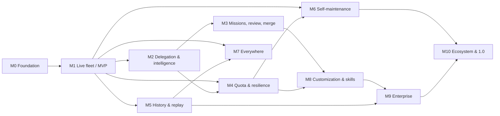

# Roadmap — milestones, steps, dependencies

Effort = working days for one engineer driving AI coding agents. Steps marked ∥ can run in parallel with the previous step. Dates are targets; `PROGRESS.md` holds actuals.

## Milestone overview

| Milestone | Theme | Steps | Effort | Exit criteria (short) | You can test… |
|---|---|---|---|---|---|
| **M0** | Foundation (MVP part 1) | 9 | ~20 d | daemon boots, web shell loads, FakeProvider session runs end-to-end in CI, all quality gates green, **provider evidence matrix filled for Claude Code + Codex on real CLIs (M0-09)** | daemon health, web nav, fake session via API, real-CLI feasibility experiments |
| **M1** | MVP: Live fleet (MVP part 2) | 13 | ~38 d | Claude Code + Codex live in tmux + worktrees, terminals in browser, prompts with a verified/limited capability record answered from web (manual-only kinds shown as such), Quick Delegate returns a branch | **the MVP** on real Claude Code + Codex (agy only if the ADR-008 gate is resolved) |
| **M2** | Delegation & intelligence | 9 | ~20 d | task typed → engine assigns provider/model with reasons → runs → Board shows it; Lead can delegate via MCP | auto-assignment, Board, Chat |
| **M3** | Missions, review & merge | 9 | ~23 d | feature → planned, split, implemented per worktree, reviewed by an independent model publisher (ADR-022), validated on the recorded commit, PR opened | full mission on a real repo |
| **M4** | Quota, budgets, resilience | 7 | ~14.5 d | 429 ⇒ cooling + reroute; official observations vs estimates labelled; admission budgets (ADR-021); clear pause when no eligible capacity | simulated + real rate limits |
| **M5** | History, recording, replay | 6 | ~14 d | replay any session with chat/events/commit-diff linked; daemon restart keeps every persisted prompt with an explicit recovery outcome (M5-05 guarantee matrix) | kill -9 daemon mid-prompt |
| **M6** | Self-maintenance | 7 | ~16 d | simulated CLI drift detected < 60 s; known drift kinds auto-remediated < 10 s only in verified quiescent state, otherwise human escalation; Health shows case | fixture drift injection |
| **M7** | Everywhere | 7 | ~15 d | signed/notarized Tauri app with updater; approve a prompt from phone via PWA push | phone approve, app update |
| **M8** | Customization & skills | 8 | ~18 d | teammate defaults; skill evals feed routing; scorecards from your outcomes | skill install + eval, scorecard |
| **M9** | Enterprise | 9 | ~22 d | trusted shared-team install (ADR-019): two users with different permissions, human-only approval gates; audit export passes review; Postgres + Helm deploy | RBAC, OIDC, container |
| **M10** | Ecosystem & 1.0 | 8 | ~20 d | third-party (trusted-tier) provider ships without core PR; repair agent proposes a passing fix; 1.0 DoD audit green with ≥ 30-day KPI window | 1.0 |

**MVP = M0 + M1** (~58 d). Everything after is additive.

**Estimate confidence:** the numbers are step-estimate sums, not delivery forecasts (R21). Provider integration (M0-09, M1-05/06), recovery correctness (M5-05, M6-04), desktop packaging (M7-01/02), enterprise isolation (M9-01) and plugin trust (M10-03) carry a 30 % contingency in `PROGRESS.md` target dates. The ≥ 30-day KPI observation window for M10-08 starts at M8 exit and overlaps M9/M10.

**Git tags at milestone exit:** `m0-foundation`, `mvp-1` (M1), `m2-intelligence`, `m3-missions`, `m4-quota`, `m5-history`, `m6-maintenance`, `m7-everywhere`, `m8-skills`, `m9-enterprise`, `v1.0.0` (M10).

## Dependency graph

Parallel lanes after M1: {M2→M3} · {M4} · {M5} can proceed concurrently; M6 waits for M4 (quota signals feed the drift classifier); of M7 only M7-03 (PWA offline queue) waits for M5-05 — M7-01/02/04/06 can start right after M1.

## Step index

Step numbers are stable ids, not the execution order: the **Depends** column is the schedule. A dependency on a later-numbered step is written `after M<x>-<nn>`; `node tools/verify-plan.mjs` rejects any other forward reference, unknown ids, self-references and dependencies on gated steps.

### M0 — Foundation (`01-m0-foundation/`)
| ID | Step | Effort | Depends | Scope (one line) |
|---|---|---|---|---|
| M0-01 | Monorepo scaffold & toolchain | 1.5 | — | pnpm+turbo, tsconfig strict, ESLint/Prettier, dependency-cruiser, .nvmrc 22, commitlint, ADR-001 stub |
| M0-02 | Core domain package | 2 | M0-01 | entities, value objects, state machines, ports, `Result`, typed errors, 100 % branch on rules |
| M0-03 | SDK, contract harness, FakeProvider | 3 | M0-02 | adapter interfaces, manifest Zod schema, contract specs, scripted FakeProvider |
| M0-04 | Daemon skeleton | 2.5 | M0-02 | NestJS/Fastify, Zod config, pino+redaction, SQLite+Kysely migrations, health, local token auth, audit interceptor |
| M0-05 | Event store & repositories | 1.5 | M0-04 | append-only events, idempotent ingestion, in-memory + sqlite repos, event bus |
| M0-06 | HTTP API + WS gateway v1 | 2 | M0-05 | REST resources, `/ws` topics, snapshot+delta, auth, OpenAPI |
| M0-07 | Web shell | 2.5 | M0-06 ∥ | React 19 app, nav/IA, design system, dark theme, RTL, WS client, empty screens, perf baseline |
| M0-08 | CI & quality gates | 2 | M0-03 ∥ | GH Actions, coverage, custom ESLint rules, egress test, Scorecard, SECURITY.md, CONTRIBUTING (DCO), CODEOWNERS |
| M0-09 | Provider feasibility gates & evidence matrix | 3 | M0-03 ∥ | human-run on real Claude Code + Codex (pinned versions): approvals incl. `updatedInput`, headless permission host, cancel, resume, usage/rate-limit signals, exit status, tmux lifecycle, adopt-after-restart; fixtures; `docs/providers/evidence-matrix.md` with `verified/limited/manual-only/unsupported/unverified` per operation × execution mode |

### M1 — MVP: Live fleet (`02-m1-mvp-live-fleet/`)
| ID | Step | Effort | Depends | Scope |
|---|---|---|---|---|
| M1-01 | tmux control-mode driver | 3 | M0-04 | `-CC` client, command/response parser, `%output`/`%exit` events, fuzz tests, fake tmux |
| M1-02 | PTY port & SessionSupervisor | 3 | M1-01 | single actor owning tmux state; start/stop/resume/reconcile; concurrency limits; crash recovery |
| M1-03 | Worktree manager | 2 | M0-04 ∥ | `git worktree` create/remove, branch naming, `.orchestra/worktrees`, scratch repo, cleanup |
| M1-04 | BinaryRegistry & provider detection | 1.5 | M0-04 ∥ | allowlist, version parse, ranges, boot detection, Fleet health rows |
| M1-05 | Claude Code adapter v1 | 5 | M0-09, M1-02, M1-04 | auth probe, launcher (interactive PTY / headless with permission host), `PreToolUse` interception of `AskUserQuestion`/`ExitPlanMode` with `updatedInput`, stream-json parsers, prompt protocol with answer states, fixtures |
| M1-06 | Codex adapter v1 | 5 | M0-09, M1-02, M1-04 ∥ | app-server JSON-RPC client on a pinned schema fixture, execution-mode labelling, `exec --json` fallback (pending prompts cancelled with reason), approvals, model switch, `account/rateLimits` |
| M1-07 | Antigravity adapter v1 (opt-in) | 3 | M1-02, M1-04 ∥ | **gated** (ADR-008 amended: terms resolution + M0-09 agy evidence row; nothing downstream depends on it): ToS ack flag, stream-json stdio, hooks, soft-deny detection, `/usage` probe (unverified), fixtures |
| M1-08 | Telemetry plane & fixture recorder | 2.5 | M1-05 | hooks receiver, parser pipeline, normalization, `orch fixtures record` |
| M1-09 | Terminals grid UI | 3 | M1-02, M0-07 | xterm WebGL, raw WS `/term`, resize, headers, broadcast, attach-externally, budgets |
| M1-10 | Fleet screen v1 + start session | 2 | M1-04, M0-07 | providers/auth/versions, sessions list, start-session dialog (provider, model, repo, worktree) |
| M1-11 | Interaction Bridge v1 & Attention queue | 4 | M1-05, M1-08 | `AgentPrompt`, classifier, answer transports, durable queue, UI answer round-trip, timeouts |
| M1-12 | Quick Delegate lite | 2.5 | M1-11, M1-03 | one task, manual provider/model, worktree, headless or interactive, result branch + diffstat |
| M1-13 | MVP acceptance | 2 | all M1 | E2E matrix on real CLIs, demo script, budgets check, restart smoke, MVP tag |

### M2 — Delegation & intelligence (`03-m2-delegation-intelligence/`)
| ID | Step | Effort | Depends | Scope |
|---|---|---|---|---|
| M2-01 | Task taxonomy catalog | 2 | M1-13 | YAML taxonomy + Zod schema + loader + hot reload + validation CLI |
| M2-02 | Model catalog & profiles v1 | 2.5 | M2-01 | model profiles data, loader, overrides, Models screen (catalog + deprecations) |
| M2-03 | Capability manifests v1 (full) | 2.5 | M1-05, M1-06 ∥ | complete manifests for claude/codex (+ agy if enabled) incl. capability records, commands discovery, prompt protocol with answer states, update sources |
| M2-04 | Assignment engine | 3 | M2-02, M2-03 | scoring, constraints, explainability, alternatives, 100 % branch coverage, golden tests vs default matrix |
| M2-05 | MCP delegation server | 3 | M2-04, M1-11 | `capabilities/delegate/status/collect/ask_user`, elicitation, tasks extension, per-Lead registration |
| M2-06 | Quick Delegate v2 | 1.5 | M2-04, M1-12 | auto-assign with preview + reasons + override |
| M2-07 | Board (kanban) | 2 | M2-06 | tasks across agents, drag to reassign (with preview), filters |
| M2-08 | Chat screen | 2.5 | M1-11 ∥ (M2-03 for full `/` palette) | rendered conversation, `/` palette from manifest commands, prompts inline, plan cards v1 |
| M2-09 | Routing policy file & decision log | 1 | M2-04 | YAML routing overrides, "why this model" panel, decisions history |

### M3 — Missions, review & merge (`04-m3-missions-review-merge/`)
| ID | Step | Effort | Depends | Scope |
|---|---|---|---|---|
| M3-01 | Playbook schema & shipped playbooks | 2 | M2-01 | YAML schema, 6 playbooks, loader, validation |
| M3-02 | Mission lifecycle & Lead session | 3 | M3-01, M2-05 | PlanMission use case, Lead launch, PLAN.md, plan versions, plan cards approve/edit/reject |
| M3-03 | Task contract & result collection | 2 | M3-02 | TaskSpec→TaskResult, result extraction from worktree (branch, diffstat, tests, summary) |
| M3-04 | Cross-vendor review rule & rounds | 3 | M3-03 | ReviewRule, reviewer assignment, findings capture, max N rounds, two-reviewer for high risk |
| M3-05 | Review & Merge UI | 4 | M3-04 | diff per task, inline comments routed to author agent, validation on the recorded commit, approval bound to sha (stale on new commits), PR head + checks recheck at merge |
| M3-06 | PR integration | 2 | M3-05 | `gh`/GitLab with user credentials, PR body from TaskResult, merge by lead/human per policy |
| M3-07 | Parallel isolation | 1.5 | M1-03 ∥ | `$ORCH_PORT`, `$ORCH_DB_SUFFIX` injection, port allocator, collision tests |
| M3-08 | Missions screen | 3 | M3-04 | DAG view, assignments + reasons, rounds, cost, status, cancel/retry |
| M3-09 | E2E feature mission acceptance | 2.5 | all M3 | real feature on a real repo across ≥ 2 providers; PR opened |

### M4 — Quota, budgets, resilience (`05-m4-quota-resilience/`)
| ID | Step | Effort | Depends | Scope |
|---|---|---|---|---|
| M4-01 | Quota signals & windows | 2.5 | M1-08, M2-03 | per-provider window parsers, official vs estimate, `provider_windows` |
| M4-02 | QuotaForecaster | 2 | M4-01 | burn-rate, time-to-limit, thresholds, 100 % branch |
| M4-03 | Rate-limit cooling & reroute | 2.5 | M4-02, M2-04 | 429 → cooling until resetAt, max one retry, reroute to next candidate, notify |
| M4-04 | Budgets & reserves | 2 | M4-02 | Lead reserve, review reserve, per-mission budget, breach events |
| M4-05 | Lead handoff | 2 | M4-04, M3-02 | PLAN.md handoff on exhaustion to another provider's Lead |
| M4-06 | Dry-run simulation | 1.5 | M4-02, M3-08 | simulate a mission's window impact before start |
| M4-07 | Fleet windows/forecast UI & KPIs | 1.5 | M4-02 | windows, forecasts, confidence labels, G2 KPIs |

### M5 — History, recording, replay (`06-m5-history-replay/`)
| ID | Step | Effort | Depends | Scope |
|---|---|---|---|---|
| M5-01 | Pane recorder (asciicast v2) | 2.5 | M1-02 | pipe-pane → asciicast, capture-time redaction, rotation, size budgets |
| M5-02 | Conversation & tool-call capture v2 | 2.5 | M1-08 | all providers, session-log ingestion, attachments |
| M5-03 | FTS5 search | 1.5 | M5-02 | FTS over messages/events/findings/plans; History screen search |
| M5-04 | Timeline & Replay UI | 3 | M5-01, M5-03 | scrubber linking replay ↔ chat ↔ events ↔ diff |
| M5-05 | Session restore with zero lost prompts | 2.5 | M1-02, M1-08, M1-11 | restart reconcile, backlog replay, prompt re-derivation, `kill -9` test |
| M5-06 | Retention, redaction, export/import | 2 | M5-04 | TTL, manual redaction, pin/tag/fork/resume/delete/purge, mission bundles |

### M6 — Self-maintenance (`07-m6-self-maintenance/`)
| ID | Step | Effort | Depends | Scope |
|---|---|---|---|---|
| M6-01 | Doctor | 2.5 | M1-04, M2-03 | `orch doctor`: boot/hourly/on-change checks, quota-free probes, report |
| M6-02 | Drift detector & classifier | 2.5 | M6-01, M4-01 | runtime signals → DriftClassifier → RepairCase; 100 % branch |
| M6-03 | Manifest registry client | 2 | M2-03 | signed manifest fetch, cache, verify, hot reload, rollback to last-known-good |
| M6-04 | Remediation ladder 1–2 | 3 | M6-02, M6-03 | safe auto-fixes + registry fix; SLO < 10 s; audit |
| M6-05 | Release watchers & canary lane | 2 | M6-01 | feeds from `updateSources`, Attention items, canary worktree verification |
| M6-06 | Model lifecycle | 1.5 | M2-02, M6-03 | deprecations → re-score → flagged policies → migration suggestion |
| M6-07 | Health screen & SLOs | 2 | M6-04 | doctor results, cases, repairs, updates, SLO metrics |

### M7 — Everywhere (`08-m7-everywhere/`)
| ID | Step | Effort | Depends | Scope |
|---|---|---|---|---|
| M7-01 | Tauri desktop shell | 3 | M1-13 | sidecar daemon, tray, native notifications, `orchestra://` deep links, raw WS for terminals |
| M7-02 | Signing, notarization, updater | 2.5 | M7-01 | hardened runtime, notarization, updater with separate key, never delete-before-verify, staged rollout, OS floor |
| M7-03 | PWA & Web Push | 2.5 | M0-07, M5-05 | installable PWA, push subscriptions, inline approve/deny, offline queue |
| M7-04 | Remote access & auth | 1.5 | M0-04 | Tailscale/Cloudflare Tunnel docs, token rotation, OIDC-ready auth module |
| M7-05 | Multi-host | 2.5 | M7-04 | several daemons in one UI, host switcher, per-host fleet |
| M7-06 | `orch` CLI | 2 | M0-06 | delegate/fleet/doctor/replay/sessions commands, JSON output |
| M7-07 | Cloud-session aggregation (optional) | 1 | M7-05 | monitor + handoff for Claude web / Codex cloud / agy remote (read-only) |

### M8 — Customization & skills (`09-m8-customization-skills/`)
| ID | Step | Effort | Depends | Scope |
|---|---|---|---|---|
| M8-01 | Layered settings engine | 2.5 | M2-09 | task > user > workspace > org > defaults; files; precedence; diff view |
| M8-02 | Policy, roles, task-type editors | 3 | M8-01 | form + YAML + live "what runs where" |
| M8-03 | Prompt library | 1.5 | M8-01 | templates with variables, scopes |
| M8-04 | Skills system | 3 | M8-01, M2-03 | artifact format, per-provider renderers, trust levels, auto-attach by taskType |
| M8-05 | Skill evals | 2 | M8-04 | `orch skill eval` fixture tasks across providers, results to outcomes |
| M8-06 | Model Scorecard & learning loop | 2.5 | M3-04, M4-01 | outcomes → bounded local weight adjustments → scorecards → export opt-in |
| M8-07 | Playbook editor | 1.5 | M3-01, M8-01 | edit/validate/version playbooks per workspace |
| M8-08 | Instruction fragments, auto-answer & notifications editors | 2 | M8-01 | CLAUDE.md/AGENTS.md composition, auto-answer rules, notification channels, update channels |

### M9 — Enterprise (`10-m9-enterprise/`)
| ID | Step | Effort | Depends | Scope |
|---|---|---|---|---|
| M9-01 | RBAC | 3 | M8-01 | users/roles/permissions, guards on every mutation, Viewer/Member/Lead/Admin |
| M9-02 | OIDC | 2 | M9-01, M7-04 | OIDC login, session, group→role mapping |
| M9-03 | Immutable audit log & SIEM export | 2 | M9-01 | hash-chained audit, export (JSONL/syslog), retention |
| M9-04 | Approval gates (4-eyes) | 2 | M9-01, M3-04 | policy-driven gates on risk/infra/merge, second approver |
| M9-05 | Postgres + S3 drivers | 3 | M0-05 | Kysely Postgres, recordings on S3, migration parity tests |
| M9-06 | Container & Helm | 2.5 | M9-05 | single image, Helm chart, tmux in container, health probes |
| M9-07 | Automations | 2.5 | M3-02, M4-04, M9-01, M9-04 | scheduled/triggered missions, watchers (git, files, webhooks) |
| M9-08 | Observability | 2 | M0-04 (metric catalog finalised after M9-03..07) | OTel export, Prometheus metrics, dashboards, alerts |
| M9-09 | Security hardening | 2 | M9-03 (ADR-017 needed early by M9-02/04/07) | encryption at rest, secrets scrubbing audit, retention policies, threat model, pen-test checklist |

### M10 — Ecosystem & 1.0 (`11-m10-ecosystem-launch/`)
| ID | Step | Effort | Depends | Scope |
|---|---|---|---|---|
| M10-01 | Repair Agent (ladder 3) | 4 | M6-04, M3-04 | sandboxed agent, inputs (fixture, help, changelog, contract tests), proposes patch, runs suite, PR/apply with approval, guardrails |
| M10-02 | Community drift loop | 2 | M6-02, M6-03, after M10-03 | opt-in anonymised drift reports → registry staleness → notifications (runs after M10-03: the registry endpoint it consumes) |
| M10-03 | Plugin/skill/playbook registry | 3 | M6-03, M8-04 | signed manifests, semver, engine compat, trust levels, install from registry/GitHub |
| M10-04 | Kimi adapter | 2.5 | M2-03 | hooks/ACP/skills, fixtures, contract tests |
| M10-05 | OpenCode adapter | 2.5 | M2-03 | one adapter for OpenAI-compatible models, fixtures |
| M10-06 | Docs site | 2.5 | M10-03 | Starlight, ADRs, Plugin Author Guide, Skill/Playbook Guide, deployment, EN + AR |
| M10-07 | Governance & releases | 2 | — | ADR-001 license final, name clearance, DCO, RFC process, CoC, semantic-release, Homebrew, npm provenance |
| M10-08 | 1.0 Definition of Done audit | 1.5 | all | checklist audit, Scorecard ≥ 7, third-party plugin proof, launch |

## Release sequence & gates (revised 2026-09-15 after external review)

| Gate | What must be true | Where |
|---|---|---|
| 1. Provider feasibility | Claude Code + Codex approval, cancellation, usage signal, restart/adopt and exit-status behaviour proven on real CLIs; evidence matrix has no `unverified` MVP-required rows | M0-09 |
| 2. Local MVP | fleet, worktrees, terminal + transcript views, prompts with verified/limited records answered from the web, Quick Delegate | M1-13 (`mvp-1`) |
| 3. Reliable orchestration | deliverable-specific task results, dependency scheduling, independent-publisher review, validation evidence bound to a commit, controlled merges | M3-09 |
| 4. Operational maturity | bounded recovery, history + checkpoints, conservative quota handling, desktop with single-owner upgrade protocol, mobile with stale-answer revalidation | M4–M7 |
| 5. Enterprise (trusted shared-team) | RBAC + OIDC + human-only gates + audit + Postgres/Helm under ADR-019; isolated per-user execution stays post-1.0 | M9 |
| 6. Ecosystem & 1.0 | kimi + opencode adapters, trusted-tier plugin registry (ADR-014 amended), docs, governance, KPI audit over ≥ 30 days | M10 |

Foundation-level safety that does not wait for M9: local token auth (M0-04), egress allowlist (M0-08), single daemon owner per data directory (M0-04/ADR-020), compliance ESLint rules (M0-08).

## 1.0 Definition of Done (from source plan §20)
Four adapters (claude, codex, kimi, opencode; agy is a fifth only if the ADR-008 gate is resolved) pass contract tests on pinned fixtures incl. approval round-trips and quota parsing, each with a filled evidence-matrix row set (no `unverified` for its declared features) · worktrees + Review & Merge end-to-end on ≥ 2 providers with validation bound to the merged commit · independent-publisher review enforced (e2e, ADR-022) · Interaction Bridge from web + PWA on every provider for prompt kinds recorded `verified`/`limited`, `manual-only` kinds surfaced honestly · Doctor + ladder 1–2 live with SLOs met for known drift kinds · Tauri signed/notarized, safe updater with the ADR-020 upgrade protocol, budgets met · restore passes the M5-05 guarantee matrix · official quota observations where exposed, estimates/unknown labelled elsewhere · OpenSSF Best Practices passing, Scorecard ≥ 7, provenance + signed artifacts, SECURITY.md · docs with ADRs + Plugin Author Guide · ≥ 1 third-party plugin · EN + AR (RTL) UI · trademark-cleared identity.
